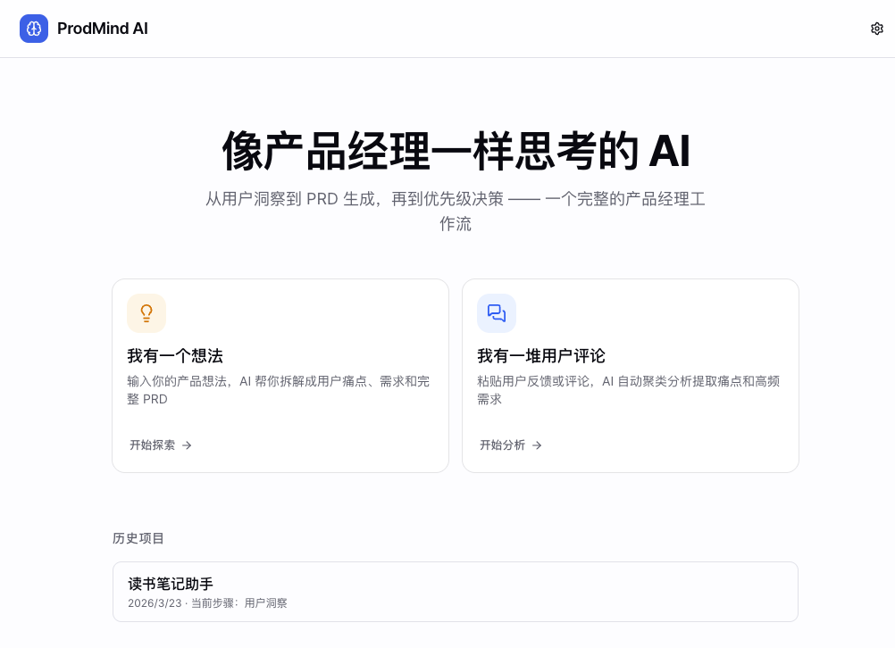
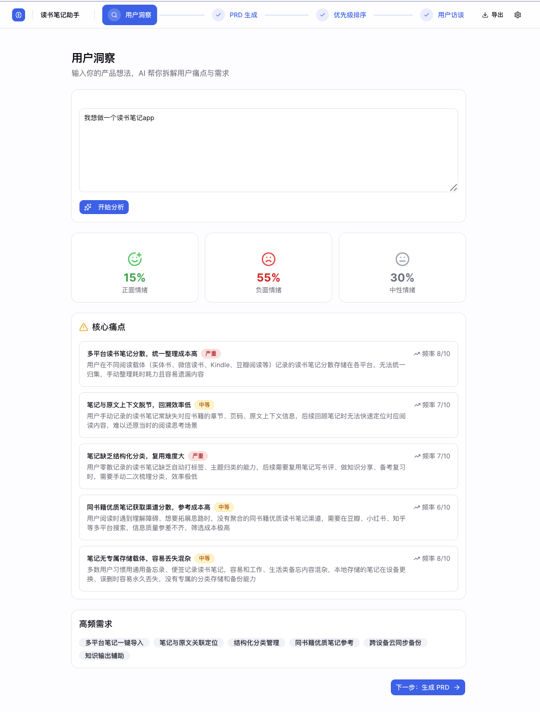
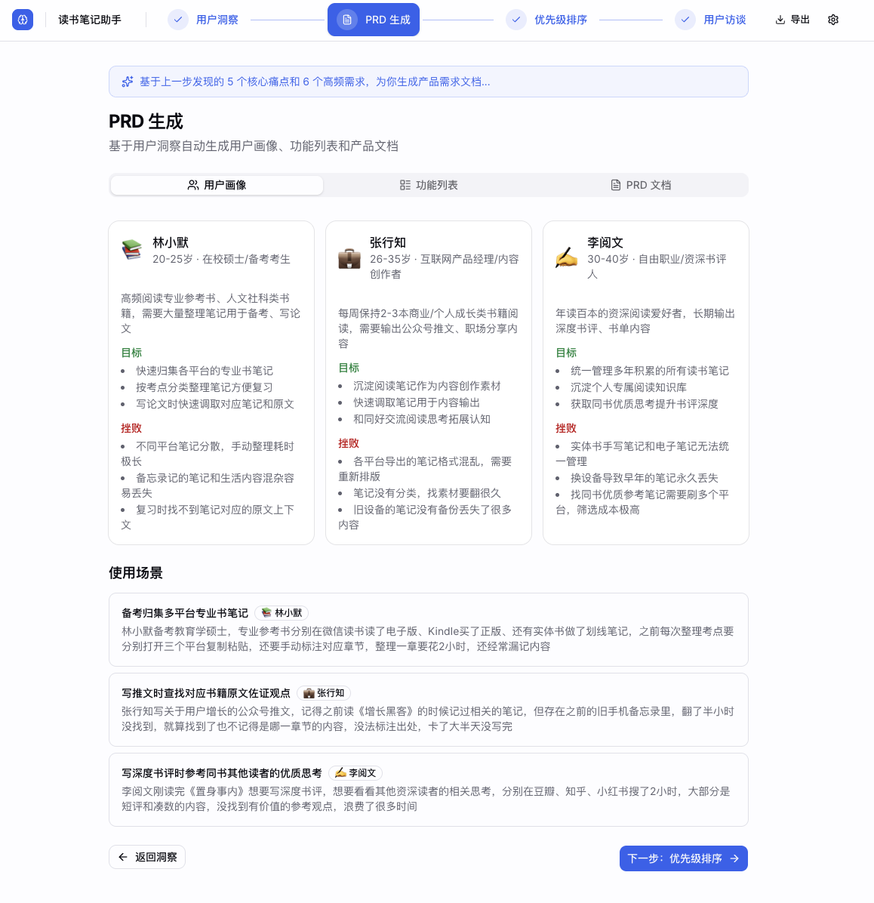
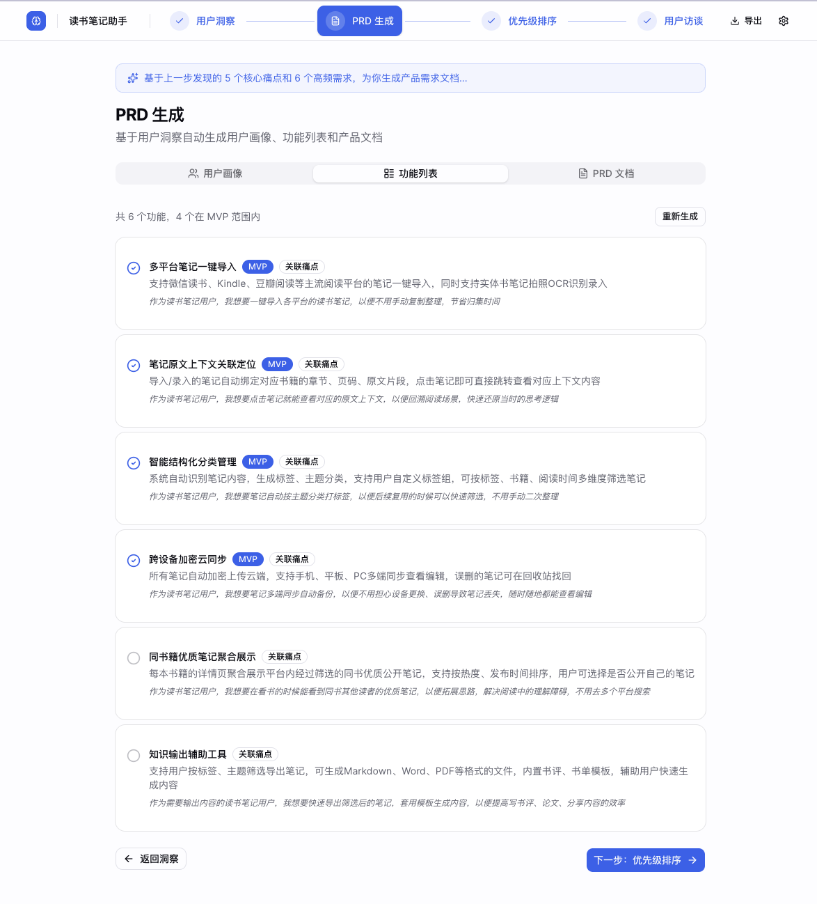
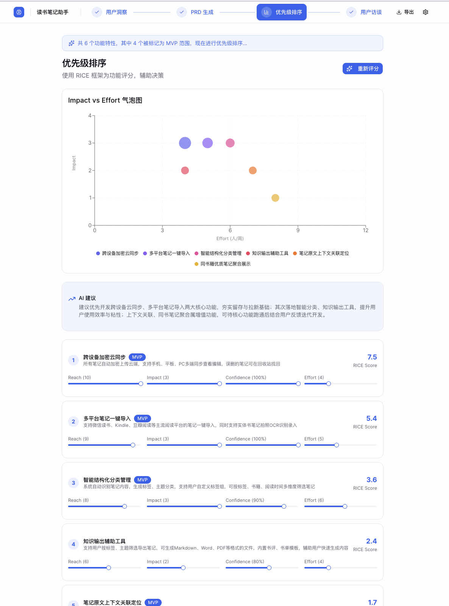
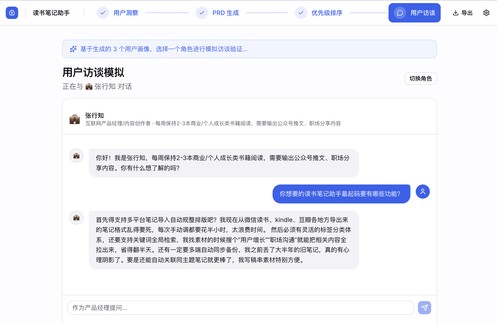
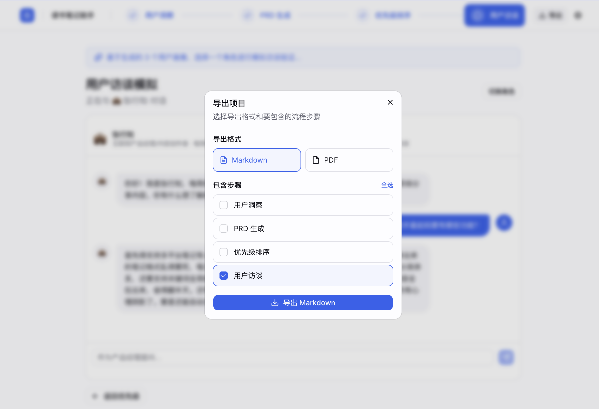

# 🧠 ProdMind AI

> **像产品经理一样思考的 AI Copilot**
> 从想法 → 用户洞察 → PRD 生成 → 优先级决策 → 用户验证，一个完整的工作流。



---

## ✨ 项目简介

ProdMind AI 是一个 AI 驱动的产品经理工作台，帮助你将模糊的想法或零散的用户反馈，转化为结构化的产品决策。

市面上的工具要么太**技术向**（数据看板、分析平台），要么太**通用**（笔记 App、ChatGPT 对话）。它们都没有模拟**真实的 PM 工作流**：

> 理解用户 → 定义问题 → 生成方案 → 做出取舍

ProdMind AI 正是为了填补这个空缺：**不是一个功能堆砌的工具箱，而是一条引导式的产品思考流程。**

---

## 🚀 为什么做这个项目

在学习产品管理的过程中，我发现一个核心矛盾：

> 产品思维是一个**连贯的决策链**，但我们的工具却是**碎片化**的。

写用户洞察用一个工具，写 PRD 用另一个，做优先级排序再换一个。每次切换上下文，思路就断了。

所以我尝试把 PM 的核心工作流串联起来，用 AI 辅助每一步的结构化输出，让"产品思考"变成一个可操作的流程，而不只是脑中的直觉。

---

## 🧩 核心功能

### 1. 🔍 用户洞察 — 痛点雷达

输入你的产品想法或用户评论，AI 自动提取结构化洞察。

**输入方式：**
- 💡「我有一个想法」— 输入产品概念，AI 帮你拆解
- 💬「我有一堆用户评论」— 粘贴反馈文本，AI 聚类分析

**输出：**
- 核心痛点（严重度 + 频率）
- 情绪分析（正面 / 负面 / 中性占比）
- 高频需求关键词



---

### 2. 📝 PRD 生成 — AI 产品文档助手

基于洞察结果，自动生成结构化 PRD。

**包含：**
- 用户画像（Persona）— 年龄、角色、目标、痛点
- 使用场景（Scenario）
- 功能列表 — 自动区分 MVP 与后续迭代
- 完整 PRD 文档 — 一键生成可交付的产品文档

<p>
  
  
</p>

---

### 3. ⚖️ 优先级排序 — RICE 决策引擎

帮你回答最关键的问题：**先做什么？**

**方法：** RICE 评分框架（Reach × Impact × Confidence ÷ Effort）

**交互：**
- 可视化气泡图 — 直观看到功能的优先级分布
- 可调整参数 — 拖动滑块微调每个维度
- AI 决策建议 — 基于评分给出优先级推荐



---

### 4. 🎭 用户访谈模拟 — AI 角色扮演

与 AI 扮演的用户画像进行产品验证对话。

**场景：** 在开发之前，先和"目标用户"聊聊你的方案
- AI 会基于之前生成的 Persona 进行角色扮演
- 模拟真实用户的反应、疑虑和期望
- 帮你提前发现产品逻辑中的盲点



---

### 5. 📤 导出 — Markdown / PDF

支持将任意步骤的产出导出为 Markdown 或 PDF 格式。

- 可选择导出单个步骤或全部流程
- PDF 导出适合作为交付物分享
- Markdown 导出方便后续编辑



---

## 🔄 产品工作流

ProdMind 被设计为一条**流水线**，而非一个工具箱 — 每一步的输出自动流入下一步：

```
用户输入（想法 / 评论）
       ↓
🔍 用户洞察提取（痛点、情绪、高频需求）
       ↓
📝 PRD 生成（画像、场景、功能、文档）
       ↓
⚖️ 优先级排序（RICE 评分 + 可视化）
       ↓
🎭 用户访谈模拟（AI 角色扮演验证）
       ↓
📤 导出（MD / PDF）
```

---

## 🧠 关键设计决策

### 1. 流程驱动，而非功能驱动

没有把每个模块做成独立工具。而是设计成一条**引导式工作流**，上一步的输出自动成为下一步的输入。这模拟了真实 PM 的工作方式。

### 2. 结构化输出，而非自由对话

所有 AI 输出都是**结构化的、可操作的**（痛点卡片、Persona 卡片、RICE 表格），而不是一段段的聊天文本。这让结果可以直接用于决策。

### 3. MVP 优先，保持克制

只做 PM 工作流中最核心的 4 个环节，不堆砌功能。聚焦 = 产品力。

### 4. 客户端架构，零后端依赖

所有 AI 调用在浏览器端直接发起，数据存储在 localStorage。用户自带 API Key，无需注册、无需后端服务器。这让部署和分享变得极其简单。

---

## 🛠️ 技术栈

| 层级 | 技术选择 | 选型理由 |
|------|----------|----------|
| **框架** | Next.js 16 + React 19 + TypeScript | App Router + 静态导出，兼顾开发体验与部署灵活性 |
| **UI** | Tailwind CSS v4 + shadcn/ui | 原子化样式 + 高质量组件，快速构建一致的界面 |
| **状态管理** | Zustand + localStorage 持久化 | 轻量、直觉式 API，天然支持持久化 |
| **AI** | OpenAI 兼容 API（客户端直连） | 支持火山引擎、SiliconFlow、OpenAI 等任意兼容服务商 |
| **可视化** | Recharts | 气泡图展示 RICE 优先级分布 |
| **PDF 导出** | html2pdf.js | 浏览器端 HTML → PDF 转换 |
| **部署** | GitHub Pages + GitHub Actions | 推送即部署，零运维成本 |

---

## ⚡ 在线体验

👉 **[Live Demo](https://wei-liping.github.io/ProdMind-AI/)**

使用前需在右上角 ⚙️ 设置中配置你的 API Key、Base URL 和模型名称（支持任何 OpenAI 兼容 API）。

---

## 🖥️ 本地开发

```bash
git clone https://github.com/wei-liping/ProdMind-AI.git
cd ProdMind-AI
npm install
npm run dev
```

打开 `http://localhost:3000`，点击右上角设置按钮配置 AI 模型信息即可使用。

---

## 📈 这个项目展示了什么

- **产品思维** — 不是"用 AI 做了个工具"，而是"设计了一条 PM 工作流并用 AI 实现"
- **结构化拆解** — 将模糊的产品管理过程拆解为可操作的步骤
- **PM 框架理解** — RICE 优先级、用户画像、MVP 范围界定、用户验证
- **端到端交付** — 从需求定义到 UI 设计到技术实现到部署上线
- **技术与产品的结合** — 用工程能力落地产品思考

---

## 🚧 未来迭代方向

- [ ] 真实数据源接入（App Store 评论 / Reddit / 社交媒体抓取）
- [ ] 多项目对比分析
- [ ] 团队协作模式（多人编辑同一项目）
- [ ] 更多导出格式（Notion / 飞书文档）
- [ ] 数据分析看板（用户行为漏斗分析）
- [ ] 国际化（英文界面支持）

---

## 🙌 致谢

这个项目的灵感来自产品经理日常工作中的真实痛点 — 工具碎片化、思维链断裂、从洞察到决策之间缺少连贯的路径。ProdMind AI 是对"如何让产品思考变得更高效"这个问题的一次探索。

---

## 📬 联系方式

如果你对这个项目感兴趣，或者想交流产品方面的想法：

- GitHub: [wei-liping](https://github.com/wei-liping)
